# Azure Backup KQL Queries – Recovery Services Vault

## Overview

These queries run against **Azure Log Analytics** using the `AzureDiagnostics` table.  
Make sure your Recovery Services Vault has **Diagnostic settings** configured to send logs to a Log Analytics workspace.

> **Table Mode:**  
> - **Azure Diagnostics mode** → all logs go to the `AzureDiagnostics` table (used in this document).  
> - **Resource Specific mode** → logs go to dedicated tables like `CoreAzureBackup`, `AddonAzureBackupJobs`, etc.  
> Check your vault's **Diagnostic settings** to confirm which mode is active.

### Common Columns Reference

| Column | Description |
|--------|-------------|
| `OperationName` | Record type: `Job`, `BackupItem`, `Policy`, `BackupItemAssociation`, etc. |
| `JobStatus_s` | Job result: `Completed`, `Failed`, `InProgress`, `CompletedWithWarnings` |
| `JobOperation_s` | Job type: `Backup`, `Restore`, `ConfigureBackup`, `DeleteBackupData` |
| `BackupItemFriendlyName_s` | Human-readable backup item name (VM name, file share name, etc.) |
| `BackupItemType_s` | Category: `VM`, `AzureFileShare`, `SQLDataBase`, `SAPHANADataBase`, etc. |
| `BackupItemUniqueId_s` | Unique identifier linking jobs to backup items |
| `BackupManagementType_s` | Management type: `IaaSVM`, `AzureStorage`, `AzureWorkload`, `MAB` |

---

## 1. Query All Jobs

Returns every backup job recorded in the vault — regardless of status.

```kql
AzureDiagnostics
| where Category == "AzureBackupReport"
| where OperationName == "Job"
| project
    TimeGenerated,
    JobOperation = column_ifexists("JobOperation_s", ""),
    JobStatus = JobStatus_s,
    BackupItemName = column_ifexists("BackupItemFriendlyName_s", ""),
    BackupItemType = column_ifexists("BackupItemType_s", ""),
    JobFailureCode = column_ifexists("JobFailureCode_s", ""),
    JobDuration = column_ifexists("JobDurationInSecs_s", ""),
    VaultName = Resource,
    ResourceGroup
| order by TimeGenerated desc
```

**Explanation:**
- Filters `AzureDiagnostics` to backup report records where `OperationName == "Job"`.
- `column_ifexists()` safely handles columns that may not exist in your workspace schema.
- Results are sorted newest-first by `TimeGenerated`.

---

## 2. Query All Details with Backup Items Name and Type

Lists all registered backup items with their friendly name, type, and management type.

```kql
AzureDiagnostics
| where Category == "AzureBackupReport"
| where OperationName == "BackupItem"
| summarize arg_max(TimeGenerated, *) by BackupItemUniqueId_s
| project
    BackupItemName = column_ifexists("BackupItemFriendlyName_s", ""),
    BackupItemType = column_ifexists("BackupItemType_s", ""),
    BackupManagementType = column_ifexists("BackupManagementType_s", ""),
    BackupItemId = BackupItemUniqueId_s,
    ProtectionState = column_ifexists("ProtectionState_s", ""),
    VaultName = Resource,
    ResourceGroup,
    LastUpdated = TimeGenerated
| order by BackupItemName asc
```

**Explanation:**
- Uses `summarize arg_max(TimeGenerated, *) by BackupItemUniqueId_s` to get the **latest record** per backup item (avoids duplicates).
- Shows the protection state so you can see if items are actively protected or stopped.

---

## 3. Query All Items and Jobs with Completed and Failed Status

Joins job records with backup item details to give a full picture of completed and failed jobs.

```kql
let Jobs = AzureDiagnostics
| where Category == "AzureBackupReport"
| where OperationName == "Job"
| where JobStatus_s in ("Completed", "Failed")
| project
    TimeGenerated,
    JobOperation = column_ifexists("JobOperation_s", ""),
    JobStatus = JobStatus_s,
    BackupItemUniqueId = column_ifexists("BackupItemUniqueId_s", ""),
    JobFailureCode = column_ifexists("JobFailureCode_s", ""),
    JobDuration = column_ifexists("JobDurationInSecs_s", ""),
    VaultName = Resource,
    ResourceGroup;
let BackupItems = AzureDiagnostics
| where Category == "AzureBackupReport"
| where OperationName == "BackupItem"
| summarize arg_max(TimeGenerated, *) by BackupItemUniqueId_s
| project
    BackupItemUniqueId = BackupItemUniqueId_s,
    BackupItemName = column_ifexists("BackupItemFriendlyName_s", ""),
    BackupItemType = column_ifexists("BackupItemType_s", ""),
    BackupManagementType = column_ifexists("BackupManagementType_s", "");
Jobs
| join kind=leftouter BackupItems on BackupItemUniqueId
| project
    TimeGenerated,
    JobOperation,
    JobStatus,
    BackupItemName,
    BackupItemType,
    BackupManagementType,
    JobFailureCode,
    JobDuration,
    VaultName,
    ResourceGroup
| order by TimeGenerated desc
```

**Explanation:**
- Creates two temporary tables: `Jobs` (filtered to Completed/Failed) and `BackupItems` (latest record per item).
- Uses `join kind=leftouter` to combine them on `BackupItemUniqueId`, so even jobs without a matching item record still appear.
- This is useful when `BackupItemFriendlyName_s` is empty in the Jobs record itself.

---

## 4. Query for Individual Backup Item Types (VM, File Share, SQL, etc.)

### 4a. Virtual Machine Backups Only

```kql
AzureDiagnostics
| where Category == "AzureBackupReport"
| where OperationName == "Job"
| where BackupItemType_s == "VM"
| project
    TimeGenerated,
    JobOperation = column_ifexists("JobOperation_s", ""),
    JobStatus = JobStatus_s,
    BackupItemName = column_ifexists("BackupItemFriendlyName_s", ""),
    JobFailureCode = column_ifexists("JobFailureCode_s", ""),
    JobDuration = column_ifexists("JobDurationInSecs_s", ""),
    VaultName = Resource
| order by TimeGenerated desc
```

### 4b. Azure File Share Backups Only

```kql
AzureDiagnostics
| where Category == "AzureBackupReport"
| where OperationName == "Job"
| where BackupItemType_s == "AzureFileShare"
| project
    TimeGenerated,
    JobOperation = column_ifexists("JobOperation_s", ""),
    JobStatus = JobStatus_s,
    BackupItemName = column_ifexists("BackupItemFriendlyName_s", ""),
    JobFailureCode = column_ifexists("JobFailureCode_s", ""),
    JobDuration = column_ifexists("JobDurationInSecs_s", ""),
    VaultName = Resource
| order by TimeGenerated desc
```

### 4c. SQL Database Backups Only

```kql
AzureDiagnostics
| where Category == "AzureBackupReport"
| where OperationName == "Job"
| where BackupItemType_s == "SQLDataBase"
| project
    TimeGenerated,
    JobOperation = column_ifexists("JobOperation_s", ""),
    JobStatus = JobStatus_s,
    BackupItemName = column_ifexists("BackupItemFriendlyName_s", ""),
    JobFailureCode = column_ifexists("JobFailureCode_s", ""),
    JobDuration = column_ifexists("JobDurationInSecs_s", ""),
    VaultName = Resource
| order by TimeGenerated desc
```

### 4d. SAP HANA Database Backups Only

```kql
AzureDiagnostics
| where Category == "AzureBackupReport"
| where OperationName == "Job"
| where BackupItemType_s == "SAPHANADataBase"
| project
    TimeGenerated,
    JobOperation = column_ifexists("JobOperation_s", ""),
    JobStatus = JobStatus_s,
    BackupItemName = column_ifexists("BackupItemFriendlyName_s", ""),
    JobFailureCode = column_ifexists("JobFailureCode_s", ""),
    JobDuration = column_ifexists("JobDurationInSecs_s", ""),
    VaultName = Resource
| order by TimeGenerated desc
```

**Explanation:**
- Each query filters on a specific `BackupItemType_s` value.
- Common values: `VM`, `AzureFileShare`, `SQLDataBase`, `SAPHANADataBase`, `MAB` (MARS agent).
- To discover all types in your environment, run:
  ```kql
  AzureDiagnostics
  | where Category == "AzureBackupReport"
  | where OperationName == "BackupItem"
  | distinct BackupItemType_s
  ```

---

## 5. Individual Resource Backup Details – Last 7 Days (Completed & Failed)

Replace `"your-item-name"` with the actual backup item name (e.g., VM name).

```kql
AzureDiagnostics
| where Category == "AzureBackupReport"
| where OperationName == "Job"
| where TimeGenerated > ago(7d)
| where JobStatus_s in ("Completed", "Failed")
| where BackupItemFriendlyName_s =~ "your-item-name"
| project
    TimeGenerated,
    JobOperation = column_ifexists("JobOperation_s", ""),
    JobStatus = JobStatus_s,
    BackupItemName = column_ifexists("BackupItemFriendlyName_s", ""),
    BackupItemType = column_ifexists("BackupItemType_s", ""),
    JobFailureCode = column_ifexists("JobFailureCode_s", ""),
    JobDuration = column_ifexists("JobDurationInSecs_s", ""),
    VaultName = Resource,
    ResourceGroup
| order by TimeGenerated desc
```

**Explanation:**
- `TimeGenerated > ago(7d)` limits results to the last 7 days.
- `=~` performs a **case-insensitive** match on the item name.
- Use `contains` instead of `=~` for partial name matching:  
  `| where BackupItemFriendlyName_s contains "partial-name"`

---

## 6. Count of Backup Jobs – Successful vs Failed (Summary)

### 6a. Overall Count by Status

```kql
AzureDiagnostics
| where Category == "AzureBackupReport"
| where OperationName == "Job"
| where JobStatus_s in ("Completed", "Failed")
| summarize
    TotalJobs = count(),
    SuccessfulJobs = countif(JobStatus_s == "Completed"),
    FailedJobs = countif(JobStatus_s == "Failed")
```

### 6b. Count by Status and Job Operation

```kql
AzureDiagnostics
| where Category == "AzureBackupReport"
| where OperationName == "Job"
| where JobStatus_s in ("Completed", "Failed")
| summarize JobCount = count() by JobStatus_s, JobOperation_s
| order by JobOperation_s asc, JobStatus_s asc
```

### 6c. Count by Status Per Vault

```kql
AzureDiagnostics
| where Category == "AzureBackupReport"
| where OperationName == "Job"
| where JobStatus_s in ("Completed", "Failed")
| summarize
    TotalJobs = count(),
    SuccessfulJobs = countif(JobStatus_s == "Completed"),
    FailedJobs = countif(JobStatus_s == "Failed")
    by VaultName = Resource
| order by VaultName asc
```

### 6d. Daily Trend – Last 7 Days

```kql
AzureDiagnostics
| where Category == "AzureBackupReport"
| where OperationName == "Job"
| where TimeGenerated > ago(7d)
| where JobStatus_s in ("Completed", "Failed")
| summarize
    SuccessfulJobs = countif(JobStatus_s == "Completed"),
    FailedJobs = countif(JobStatus_s == "Failed")
    by bin(TimeGenerated, 1d)
| order by TimeGenerated asc
```

**Explanation:**
- `countif()` counts rows matching a condition without needing separate filters.
- `bin(TimeGenerated, 1d)` groups results into daily buckets for trend analysis.
- Query 6d is ideal for creating a **time chart** in Log Analytics: add `| render timechart` at the end.

---

## 7. Count of Backup Items by Type (Category Breakdown)

### 7a. Total Backup Items Per Type

```kql
AzureDiagnostics
| where Category == "AzureBackupReport"
| where OperationName == "BackupItem"
| summarize arg_max(TimeGenerated, *) by BackupItemUniqueId_s
| summarize ItemCount = count() by BackupItemType = column_ifexists("BackupItemType_s", "Unknown")
| order by ItemCount desc
```

### 7b. Backup Items Per Type and Management Type

```kql
AzureDiagnostics
| where Category == "AzureBackupReport"
| where OperationName == "BackupItem"
| summarize arg_max(TimeGenerated, *) by BackupItemUniqueId_s
| summarize ItemCount = count()
    by BackupItemType = column_ifexists("BackupItemType_s", "Unknown"),
       BackupManagementType = column_ifexists("BackupManagementType_s", "Unknown")
| order by BackupItemType asc, ItemCount desc
```

### 7c. Backup Items Per Type Per Vault

```kql
AzureDiagnostics
| where Category == "AzureBackupReport"
| where OperationName == "BackupItem"
| summarize arg_max(TimeGenerated, *) by BackupItemUniqueId_s
| summarize ItemCount = count()
    by VaultName = Resource,
       BackupItemType = column_ifexists("BackupItemType_s", "Unknown")
| order by VaultName asc, ItemCount desc
```

### 7d. Pie Chart – Items by Type (Visual)

```kql
AzureDiagnostics
| where Category == "AzureBackupReport"
| where OperationName == "BackupItem"
| summarize arg_max(TimeGenerated, *) by BackupItemUniqueId_s
| summarize ItemCount = count() by BackupItemType = column_ifexists("BackupItemType_s", "Unknown")
| render piechart
```

**Explanation:**
- `arg_max(TimeGenerated, *) by BackupItemUniqueId_s` deduplicates to get one row per item (the latest).
- The second `summarize` then counts items per category.
- `render piechart` generates a visual chart directly in Log Analytics.

---

## 8. CRITICAL: Missed/Stale Backups – Items Not Backed Up Recently (SLA Breach Risk)

> **Why this matters:** If a backup item hasn't had a successful backup in 24-48 hours, you may be violating your RPO. This is the #1 query every production admin should run daily.

### 8a. Items with No Successful Backup in Last 24 Hours

```kql
let SuccessfulItems = AzureDiagnostics
| where Category == "AzureBackupReport"
| where OperationName == "Job"
| where TimeGenerated > ago(24h)
| where JobStatus_s == "Completed"
| where column_ifexists("JobOperation_s", "") == "Backup"
| distinct BackupItemUniqueId_s;
AzureDiagnostics
| where Category == "AzureBackupReport"
| where OperationName == "BackupItem"
| summarize arg_max(TimeGenerated, *) by BackupItemUniqueId_s
| where BackupItemUniqueId_s !in (SuccessfulItems)
| project
    BackupItemName = column_ifexists("BackupItemFriendlyName_s", ""),
    BackupItemType = column_ifexists("BackupItemType_s", ""),
    ProtectionState = column_ifexists("ProtectionState_s", ""),
    VaultName = Resource,
    ResourceGroup,
    LastSeen = TimeGenerated
| order by BackupItemName asc
```

### 8b. Last Successful Backup Per Item (Stale Detection)

```kql
AzureDiagnostics
| where Category == "AzureBackupReport"
| where OperationName == "Job"
| where JobStatus_s == "Completed"
| where column_ifexists("JobOperation_s", "") == "Backup"
| summarize LastSuccessfulBackup = max(TimeGenerated) by
    BackupItemName = column_ifexists("BackupItemFriendlyName_s", ""),
    BackupItemType = column_ifexists("BackupItemType_s", ""),
    VaultName = Resource
| extend HoursSinceLastBackup = datetime_diff('hour', now(), LastSuccessfulBackup)
| extend SLAStatus = case(
    HoursSinceLastBackup <= 24, "Within SLA",
    HoursSinceLastBackup <= 48, "WARNING - Approaching SLA",
    "CRITICAL - SLA Breached")
| order by HoursSinceLastBackup desc
```

**Explanation:**
- Calculates hours since each item's last successful backup.
- Tags each item as Within SLA / WARNING / CRITICAL based on time elapsed.
- Items at the top of the list need immediate attention.

---

## 9. CRITICAL: Consecutively Failing Backup Items (Recurring Failures)

> **Why this matters:** A single failure can be transient. Multiple consecutive failures indicate a persistent issue requiring manual intervention (disk full, agent offline, permissions changed, etc.).

```kql
AzureDiagnostics
| where Category == "AzureBackupReport"
| where OperationName == "Job"
| where column_ifexists("JobOperation_s", "") == "Backup"
| where TimeGenerated > ago(7d)
| summarize
    TotalJobs = count(),
    FailedJobs = countif(JobStatus_s == "Failed"),
    LastFailure = maxif(TimeGenerated, JobStatus_s == "Failed"),
    LastSuccess = maxif(TimeGenerated, JobStatus_s == "Completed"),
    FailureCodes = make_set(column_ifexists("JobFailureCode_s", ""))
    by BackupItemName = column_ifexists("BackupItemFriendlyName_s", ""),
       BackupItemType = column_ifexists("BackupItemType_s", ""),
       VaultName = Resource
| where FailedJobs >= 2
| extend ConsecutiveFailure = iff(isempty(LastSuccess) or LastFailure > LastSuccess, "YES", "NO")
| order by FailedJobs desc
```

**Explanation:**
- Identifies items with 2+ failures in the last 7 days.
- `ConsecutiveFailure = YES` means the last job was a failure with no success after it — highest priority.
- `FailureCodes` shows the error codes to help diagnose the root cause.

---

## 10. CRITICAL: Long-Running / Stuck Backup Jobs

> **Why this matters:** Backup jobs stuck for hours consume vault resources, block other backups, and indicate infrastructure issues (network, storage throttling, VM agent hang).

```kql
AzureDiagnostics
| where Category == "AzureBackupReport"
| where OperationName == "Job"
| where JobStatus_s == "InProgress"
| extend JobDurationHours = datetime_diff('hour', now(), TimeGenerated)
| where JobDurationHours > 4
| project
    TimeGenerated,
    JobOperation = column_ifexists("JobOperation_s", ""),
    JobStatus = JobStatus_s,
    RunningForHours = JobDurationHours,
    BackupItemName = column_ifexists("BackupItemFriendlyName_s", ""),
    BackupItemType = column_ifexists("BackupItemType_s", ""),
    VaultName = Resource,
    ResourceGroup
| order by RunningForHours desc
```

**Explanation:**
- Finds InProgress jobs running for more than 4 hours.
- Adjust the `> 4` threshold based on your environment (large SQL databases may take longer).

---

## 11. Backup Failure Root Cause Analysis – Top Error Codes

> **Why this matters:** Knowing the most common failure reasons lets you fix systemic issues rather than fighting fires.

### 11a. Top 10 Failure Codes

```kql
AzureDiagnostics
| where Category == "AzureBackupReport"
| where OperationName == "Job"
| where JobStatus_s == "Failed"
| where TimeGenerated > ago(30d)
| summarize FailureCount = count()
    by FailureCode = column_ifexists("JobFailureCode_s", "Unknown")
| top 10 by FailureCount desc
```

### 11b. Failure Breakdown Per Item Type

```kql
AzureDiagnostics
| where Category == "AzureBackupReport"
| where OperationName == "Job"
| where JobStatus_s == "Failed"
| where TimeGenerated > ago(30d)
| summarize FailureCount = count()
    by BackupItemType = column_ifexists("BackupItemType_s", "Unknown"),
       FailureCode = column_ifexists("JobFailureCode_s", "Unknown")
| order by BackupItemType asc, FailureCount desc
```

---

## 12. Backup Health Score – Success Rate Per Item (Last 30 Days)

> **Why this matters:** A success rate below 95% means an item is unreliable and may fail during a real disaster recovery scenario.

```kql
AzureDiagnostics
| where Category == "AzureBackupReport"
| where OperationName == "Job"
| where column_ifexists("JobOperation_s", "") == "Backup"
| where TimeGenerated > ago(30d)
| summarize
    TotalJobs = count(),
    SuccessCount = countif(JobStatus_s == "Completed"),
    FailCount = countif(JobStatus_s == "Failed")
    by BackupItemName = column_ifexists("BackupItemFriendlyName_s", ""),
       BackupItemType = column_ifexists("BackupItemType_s", ""),
       VaultName = Resource
| extend SuccessRate = round(100.0 * SuccessCount / TotalJobs, 1)
| extend HealthStatus = case(
    SuccessRate >= 99, "Healthy",
    SuccessRate >= 95, "Degraded",
    SuccessRate >= 80, "At Risk",
    "Critical")
| order by SuccessRate asc
```

**Explanation:**
- Calculates success percentage per backup item.
- Color-coded health: Healthy (99%+), Degraded (95-99%), At Risk (80-95%), Critical (<80%).
- Items with lowest success rate appear first — prioritize fixes.

---

## 13. Restore Job Monitoring

> **Why this matters:** Restores only happen during incidents. Monitoring restore jobs ensures your disaster recovery actually works.

### 13a. All Restore Jobs

```kql
AzureDiagnostics
| where Category == "AzureBackupReport"
| where OperationName == "Job"
| where column_ifexists("JobOperation_s", "") == "Restore"
| project
    TimeGenerated,
    JobStatus = JobStatus_s,
    BackupItemName = column_ifexists("BackupItemFriendlyName_s", ""),
    BackupItemType = column_ifexists("BackupItemType_s", ""),
    JobDuration = column_ifexists("JobDurationInSecs_s", ""),
    JobFailureCode = column_ifexists("JobFailureCode_s", ""),
    VaultName = Resource,
    ResourceGroup
| order by TimeGenerated desc
```

### 13b. Failed Restores (Immediate Alert Needed)

```kql
AzureDiagnostics
| where Category == "AzureBackupReport"
| where OperationName == "Job"
| where column_ifexists("JobOperation_s", "") == "Restore"
| where JobStatus_s == "Failed"
| where TimeGenerated > ago(7d)
| project
    TimeGenerated,
    BackupItemName = column_ifexists("BackupItemFriendlyName_s", ""),
    BackupItemType = column_ifexists("BackupItemType_s", ""),
    JobFailureCode = column_ifexists("JobFailureCode_s", ""),
    VaultName = Resource
| order by TimeGenerated desc
```

---

## 14. Backup Policy Changes Audit Trail

> **Why this matters:** Unauthorized policy changes (reduced retention, disabled schedule) can silently destroy your disaster recovery capability. This must be audited.

```kql
AzureDiagnostics
| where Category == "AzureBackupReport"
| where OperationName == "Policy" or OperationName == "PolicyAssociation"
| project
    TimeGenerated,
    OperationName,
    PolicyName = column_ifexists("PolicyName_s", ""),
    PolicyUniqueId = column_ifexists("PolicyUniqueId_s", ""),
    BackupItemName = column_ifexists("BackupItemFriendlyName_s", ""),
    VaultName = Resource,
    ResourceGroup
| order by TimeGenerated desc
```

---

## 15. Delete Backup Data Operations (Security Alert)

> **Why this matters:** Ransomware attackers and malicious insiders often delete backups before encrypting production data. Any `DeleteBackupData` operation should trigger an immediate security review.

```kql
AzureDiagnostics
| where Category == "AzureBackupReport"
| where OperationName == "Job"
| where column_ifexists("JobOperation_s", "") in ("DeleteBackupData", "StopProtection")
| project
    TimeGenerated,
    JobOperation = column_ifexists("JobOperation_s", ""),
    JobStatus = JobStatus_s,
    BackupItemName = column_ifexists("BackupItemFriendlyName_s", ""),
    BackupItemType = column_ifexists("BackupItemType_s", ""),
    VaultName = Resource,
    ResourceGroup
| order by TimeGenerated desc
```

**Recommendation:** Create an **Azure Monitor Alert Rule** on this query to get email/SMS/Teams notifications immediately.

---

## 16. Backup Storage Growth Trend (Capacity Planning)

> **Why this matters:** Unexpected storage spikes increase costs. Steady growth tracking helps forecast budget and plan retention adjustments.

```kql
AzureDiagnostics
| where Category == "AzureBackupReport"
| where OperationName == "StorageAssociation" or OperationName == "Storage"
| extend StorageConsumedGB = todouble(column_ifexists("StorageConsumedInMBs_s", "0")) / 1024.0
| summarize AvgStorageGB = avg(StorageConsumedGB)
    by bin(TimeGenerated, 1d),
       VaultName = Resource
| order by TimeGenerated asc
| render timechart
```

---

## 17. Vault-Level Health Dashboard (Executive Summary)

> **Why this matters:** A single-pane view of all vault health — perfect for daily ops review or management reporting.

```kql
AzureDiagnostics
| where Category == "AzureBackupReport"
| where OperationName == "Job"
| where column_ifexists("JobOperation_s", "") == "Backup"
| where TimeGenerated > ago(24h)
| summarize
    TotalJobs = count(),
    Successful = countif(JobStatus_s == "Completed"),
    Failed = countif(JobStatus_s == "Failed"),
    InProgress = countif(JobStatus_s == "InProgress"),
    WithWarnings = countif(JobStatus_s == "CompletedWithWarnings")
    by VaultName = Resource, ResourceGroup
| extend SuccessRate = round(100.0 * Successful / TotalJobs, 1)
| extend VaultHealth = case(
    Failed == 0 and SuccessRate == 100, "HEALTHY",
    SuccessRate >= 95, "WARNING",
    "CRITICAL")
| order by SuccessRate asc
```

---

## 18. Weekend / Off-Hours Backup Failure Detection

> **Why this matters:** Failures on weekends and nights often go unnoticed until Monday morning. This query highlights failures that occurred outside business hours.

```kql
AzureDiagnostics
| where Category == "AzureBackupReport"
| where OperationName == "Job"
| where JobStatus_s == "Failed"
| where TimeGenerated > ago(3d)
| extend HourOfDay = hourofday(TimeGenerated)
| extend DayOfWeek = dayofweek(TimeGenerated) / 1d
| extend IsOffHours = iff(DayOfWeek >= 5 or HourOfDay < 7 or HourOfDay > 19, "Off-Hours", "Business-Hours")
| where IsOffHours == "Off-Hours"
| project
    TimeGenerated,
    DayOfWeek = case(
        DayOfWeek == 0, "Sunday",
        DayOfWeek == 1, "Monday",
        DayOfWeek == 2, "Tuesday",
        DayOfWeek == 3, "Wednesday",
        DayOfWeek == 4, "Thursday",
        DayOfWeek == 5, "Friday",
        "Saturday"),
    HourOfDay,
    BackupItemName = column_ifexists("BackupItemFriendlyName_s", ""),
    BackupItemType = column_ifexists("BackupItemType_s", ""),
    JobFailureCode = column_ifexists("JobFailureCode_s", ""),
    VaultName = Resource
| order by TimeGenerated desc
```

---

## 19. Backup Job Duration Anomaly Detection

> **Why this matters:** If a backup that normally takes 30 minutes suddenly takes 3 hours, it indicates storage throttling, network issues, or data churn. Catch it before it becomes a failure.

```kql
AzureDiagnostics
| where Category == "AzureBackupReport"
| where OperationName == "Job"
| where column_ifexists("JobOperation_s", "") == "Backup"
| where JobStatus_s == "Completed"
| where TimeGenerated > ago(30d)
| extend DurationMinutes = todouble(column_ifexists("JobDurationInSecs_s", "0")) / 60.0
| summarize
    AvgDuration = avg(DurationMinutes),
    MaxDuration = max(DurationMinutes),
    MinDuration = min(DurationMinutes),
    StdDev = stdev(DurationMinutes),
    JobCount = count()
    by BackupItemName = column_ifexists("BackupItemFriendlyName_s", ""),
       BackupItemType = column_ifexists("BackupItemType_s", "")
| extend UpperThreshold = AvgDuration + (2 * StdDev)
| where MaxDuration > UpperThreshold and JobCount > 3
| project
    BackupItemName,
    BackupItemType,
    AvgDurationMins = round(AvgDuration, 1),
    MaxDurationMins = round(MaxDuration, 1),
    ThresholdMins = round(UpperThreshold, 1),
    AnomalyFactor = round(MaxDuration / AvgDuration, 1)
| order by AnomalyFactor desc
```

**Explanation:**
- Uses standard deviation to detect outliers (any max duration > average + 2 standard deviations).
- `AnomalyFactor` shows how many times slower the worst run was vs. the average.

---

## 20. Weekly Backup Compliance Report (Auditor-Ready)

> **Why this matters:** Compliance frameworks (ISO 27001, SOC 2, HIPAA) require evidence that backups ran successfully. This generates a weekly summary per item.

```kql
AzureDiagnostics
| where Category == "AzureBackupReport"
| where OperationName == "Job"
| where column_ifexists("JobOperation_s", "") == "Backup"
| where TimeGenerated > ago(7d)
| summarize
    TotalBackupJobs = count(),
    SuccessfulBackups = countif(JobStatus_s == "Completed"),
    FailedBackups = countif(JobStatus_s == "Failed"),
    LastBackupTime = maxif(TimeGenerated, JobStatus_s == "Completed")
    by BackupItemName = column_ifexists("BackupItemFriendlyName_s", ""),
       BackupItemType = column_ifexists("BackupItemType_s", ""),
       VaultName = Resource
| extend SuccessRate = round(100.0 * SuccessfulBackups / TotalBackupJobs, 1)
| extend ComplianceStatus = iff(SuccessRate == 100 and isnotempty(LastBackupTime), "COMPLIANT", "NON-COMPLIANT")
| extend DaysSinceLastBackup = datetime_diff('day', now(), LastBackupTime)
| order by ComplianceStatus desc, SuccessRate asc
```

---

## Production Alert Rules – Recommended Setup

Use these queries as **Azure Monitor Alert Rules** (Log Analytics → Alerts → New Alert Rule):

| Alert Name | Query Filter | Frequency | Severity |
|---|---|---|---|
| **Backup Failed** | `JobStatus_s == "Failed"` | Every 1 hour | Sev 2 |
| **Backup Stuck > 6 hrs** | `InProgress` + duration > 6h | Every 1 hour | Sev 2 |
| **Missed Backup > 24h** | No success in 24h (Query 8a) | Every 6 hours | Sev 1 |
| **Consecutive Failures ≥ 3** | FailedJobs ≥ 3 (Query 9) | Every 6 hours | Sev 1 |
| **Backup Data Deleted** | `DeleteBackupData` (Query 15) | Every 15 min | Sev 0 (Critical) |
| **Restore Failed** | Restore + Failed (Query 13b) | Every 1 hour | Sev 1 |
| **Success Rate < 90%** | SuccessRate < 90 (Query 12) | Daily | Sev 2 |
| **Policy Changed** | Policy operations (Query 14) | Every 1 hour | Sev 3 |

---

# Azure Logic Apps KQL Queries

## Overview

These queries run against **Azure Log Analytics** using the `AzureDiagnostics` table for Logic Apps.  
Make sure your Logic App has **Diagnostic settings** configured to send `WorkflowRuntime` logs to a Log Analytics workspace.

> **Prerequisites:**  
> - Logic App → **Diagnostic settings** → Send to Log Analytics workspace  
> - Enable **WorkflowRuntime** log category  
> - Logs appear in `AzureDiagnostics` with `Category == "WorkflowRuntime"`

### Common Columns Reference

| Column | Description |
|--------|-------------|
| `resource_workflowName_s` | Logic App workflow name |
| `resource_runId_s` | Unique run identifier |
| `resource_actionName_s` | Action name within the workflow |
| `status_s` | Run/action result: `Succeeded`, `Failed`, `Running`, `Cancelled`, `Skipped` |
| `OperationName` | Event type: `Microsoft.Logic/workflows/workflowRunCompleted`, `Microsoft.Logic/workflows/workflowActionCompleted`, etc. |
| `startTime_t` | Run/action start time |
| `endTime_t` | Run/action end time |
| `error_code_s` | Error code (when status is Failed) |
| `error_message_s` | Error message (when status is Failed) |

---

## 21. All Running Logic App Jobs

Returns all Logic App workflow runs currently in `Running` status.

```kql
AzureDiagnostics
| where Category == "WorkflowRuntime"
| where OperationName == "Microsoft.Logic/workflows/workflowRunCompleted"
    or OperationName == "Microsoft.Logic/workflows/workflowRunStarted"
| summarize arg_max(TimeGenerated, *) by resource_runId_s
| where status_s == "Running"
| project
    TimeGenerated,
    WorkflowName = resource_workflowName_s,
    RunId = resource_runId_s,
    Status = status_s,
    StartTime = column_ifexists("startTime_t", datetime(null)),
    RunningDuration = datetime_diff('minute', now(), column_ifexists("startTime_t", now())),
    Resource,
    ResourceGroup
| order by TimeGenerated desc
```

**Explanation:**
- Uses `arg_max(TimeGenerated, *) by resource_runId_s` to get the latest status per run.
- Filters to `Running` status to show only in-progress executions.
- `RunningDuration` shows how many minutes the run has been active.

---

## 22. All Successful Logic App Jobs

Returns all Logic App workflow runs that completed successfully.

```kql
AzureDiagnostics
| where Category == "WorkflowRuntime"
| where OperationName == "Microsoft.Logic/workflows/workflowRunCompleted"
| where status_s == "Succeeded"
| project
    TimeGenerated,
    WorkflowName = resource_workflowName_s,
    RunId = resource_runId_s,
    Status = status_s,
    StartTime = column_ifexists("startTime_t", datetime(null)),
    EndTime = column_ifexists("endTime_t", datetime(null)),
    DurationSeconds = datetime_diff('second',
        column_ifexists("endTime_t", datetime(null)),
        column_ifexists("startTime_t", datetime(null))),
    Resource,
    ResourceGroup
| order by TimeGenerated desc
```

**Explanation:**
- Filters on `workflowRunCompleted` with `Succeeded` status.
- Calculates run duration in seconds from start to end time.

---

## 23. Specific Logic App – Recent Run History with Last Result (Success / Failed)

Replace `"your-logic-app-name"` with the actual Logic App workflow name.

```kql
AzureDiagnostics
| where Category == "WorkflowRuntime"
| where OperationName == "Microsoft.Logic/workflows/workflowRunCompleted"
| where resource_workflowName_s =~ "your-logic-app-name"
| project
    TimeGenerated,
    WorkflowName = resource_workflowName_s,
    RunId = resource_runId_s,
    Status = status_s,
    StartTime = column_ifexists("startTime_t", datetime(null)),
    EndTime = column_ifexists("endTime_t", datetime(null)),
    DurationSeconds = datetime_diff('second',
        column_ifexists("endTime_t", datetime(null)),
        column_ifexists("startTime_t", datetime(null))),
    ErrorCode = column_ifexists("error_code_s", ""),
    ErrorMessage = column_ifexists("error_message_s", ""),
    Resource,
    ResourceGroup
| order by TimeGenerated desc
```

### 23b. Last Run Result Only (Quick Health Check)

```kql
AzureDiagnostics
| where Category == "WorkflowRuntime"
| where OperationName == "Microsoft.Logic/workflows/workflowRunCompleted"
| where resource_workflowName_s =~ "your-logic-app-name"
| top 1 by TimeGenerated desc
| project
    WorkflowName = resource_workflowName_s,
    LastRunTime = TimeGenerated,
    LastStatus = status_s,
    ErrorCode = column_ifexists("error_code_s", ""),
    ErrorMessage = column_ifexists("error_message_s", ""),
    HealthCheck = iff(status_s == "Succeeded", "PASS", "FAIL")
```

**Explanation:**
- Query 23 returns the full run history for a specific Logic App, including error details for failed runs.
- Query 23b returns only the most recent run with a `PASS` / `FAIL` health indicator.
- `=~` performs a case-insensitive match on the workflow name.

---

## 24. Specific Logic App – Last 5 Runs in the Past 10 Minutes (Success / Failed)

Replace `"your-logic-app-name"` with the actual Logic App workflow name.

```kql
AzureDiagnostics
| where Category == "WorkflowRuntime"
| where OperationName == "Microsoft.Logic/workflows/workflowRunCompleted"
| where resource_workflowName_s =~ "your-logic-app-name"
| where TimeGenerated > ago(10m)
| top 5 by TimeGenerated desc
| project
    TimeGenerated,
    WorkflowName = resource_workflowName_s,
    RunId = resource_runId_s,
    Status = status_s,
    ErrorCode = column_ifexists("error_code_s", ""),
    ErrorMessage = column_ifexists("error_message_s", "")
```

### 24b. Summary of Last 5 Runs in 10 Minutes

```kql
AzureDiagnostics
| where Category == "WorkflowRuntime"
| where OperationName == "Microsoft.Logic/workflows/workflowRunCompleted"
| where resource_workflowName_s =~ "your-logic-app-name"
| where TimeGenerated > ago(10m)
| top 5 by TimeGenerated desc
| summarize
    TotalRuns = count(),
    Succeeded = countif(status_s == "Succeeded"),
    Failed = countif(status_s == "Failed"),
    LastRunTime = max(TimeGenerated),
    LastStatus = take_any(status_s)
| extend QuickVerdict = case(
    Failed == 0, "ALL PASSED",
    Succeeded == 0, "ALL FAILED",
    strcat(tostring(Failed), " of ", tostring(TotalRuns), " FAILED"))
```

**Explanation:**
- Scopes to the last 10 minutes and takes only the 5 most recent completed runs.
- Query 24b provides a summary with a `QuickVerdict` field for fast triage.

---

## 25. Metrics Chart – Success / Failure Ratio Per Logic App (Last 24 Hours)

### 25a. Success / Failure Count Per Workflow (Table)

```kql
AzureDiagnostics
| where Category == "WorkflowRuntime"
| where OperationName == "Microsoft.Logic/workflows/workflowRunCompleted"
| where TimeGenerated > ago(24h)
| where status_s in ("Succeeded", "Failed")
| summarize
    TotalRuns = count(),
    Succeeded = countif(status_s == "Succeeded"),
    Failed = countif(status_s == "Failed")
    by WorkflowName = resource_workflowName_s
| extend SuccessRate = round(100.0 * Succeeded / TotalRuns, 1)
| extend HealthStatus = case(
    SuccessRate == 100, "Healthy",
    SuccessRate >= 90, "Degraded",
    SuccessRate >= 50, "At Risk",
    "Critical")
| order by SuccessRate asc
```

### 25b. Hourly Trend – Success vs Failure Per Workflow (Time Chart)

```kql
AzureDiagnostics
| where Category == "WorkflowRuntime"
| where OperationName == "Microsoft.Logic/workflows/workflowRunCompleted"
| where TimeGenerated > ago(24h)
| where status_s in ("Succeeded", "Failed")
| summarize
    Succeeded = countif(status_s == "Succeeded"),
    Failed = countif(status_s == "Failed")
    by bin(TimeGenerated, 1h), WorkflowName = resource_workflowName_s
| order by TimeGenerated asc
| render timechart
```

### 25c. Stacked Bar Chart – S/F Ratio Per Workflow

```kql
AzureDiagnostics
| where Category == "WorkflowRuntime"
| where OperationName == "Microsoft.Logic/workflows/workflowRunCompleted"
| where TimeGenerated > ago(24h)
| where status_s in ("Succeeded", "Failed")
| summarize RunCount = count() by WorkflowName = resource_workflowName_s, Status = status_s
| render barchart
```

### 25d. Pie Chart – Overall S/F Split Across All Logic Apps

```kql
AzureDiagnostics
| where Category == "WorkflowRuntime"
| where OperationName == "Microsoft.Logic/workflows/workflowRunCompleted"
| where TimeGenerated > ago(24h)
| where status_s in ("Succeeded", "Failed")
| summarize RunCount = count() by Status = status_s
| render piechart
```

**Explanation:**
- **25a** gives a table with success rate and health status per Logic App — sort ascending to see worst performers first.
- **25b** renders an hourly time chart showing Succeeded vs Failed trends — ideal for dashboards.
- **25c** renders a stacked bar chart comparing each workflow's success/failure distribution.
- **25d** renders a pie chart of overall success vs failure across all Logic Apps.
- Add `| render timechart` or `| render barchart` at the end in Log Analytics to visualize directly.

---

## Quick Reference – Common Filters

| Purpose | Add this line to any query |
|---------|---------------------------|
| Last 24 hours | `\| where TimeGenerated > ago(24h)` |
| Last 7 days | `\| where TimeGenerated > ago(7d)` |
| Last 30 days | `\| where TimeGenerated > ago(30d)` |
| Specific vault | `\| where Resource =~ "my-vault-name"` |
| Specific resource group | `\| where ResourceGroup =~ "my-rg"` |
| VM backups only | `\| where BackupItemType_s == "VM"` |
| File share only | `\| where BackupItemType_s == "AzureFileShare"` |
| SQL only | `\| where BackupItemType_s == "SQLDataBase"` |
| Failed jobs only | `\| where JobStatus_s == "Failed"` |
| Partial name match | `\| where BackupItemFriendlyName_s contains "partial"` |

---

## Troubleshooting

| Issue | Solution |
|-------|----------|
| No data returned | Verify Diagnostic settings are enabled on the vault and logs are sent to the correct workspace. |
| Column not found error | Use `column_ifexists("column_name", "")` to handle missing columns safely. |
| Empty `BackupItemFriendlyName_s` | The name may be in a separate `BackupItem` record — use the JOIN query from Section 3. |
| Discover all column names | Run: `AzureDiagnostics \| where Category == "AzureBackupReport" \| take 1 \| getschema` |
| Find all backup item types | Run: `AzureDiagnostics \| where OperationName == "BackupItem" \| distinct BackupItemType_s` |

---

## Azure Dashboard — Manual Tile Creation Guide

Create tiles manually in Azure Portal for full control over visualization.

### How to Create Each Tile

1. Go to **Azure Portal** → **Dashboard** → click **+ New dashboard** (or edit existing)
2. Click **Edit** → **+ Add a tile** → choose **Logs** (under Monitoring)
3. Select your **Log Analytics workspace** (e.g., OMS-UCM)
4. Paste the query from each tile below
5. Set the **Visualization** type as specified
6. Set the **Time Range** as specified
7. Click **Apply** → give the tile the name shown
8. Resize and arrange tiles on the dashboard grid

> **Tip:** Create section headers using **Markdown** tiles (Add a tile → Markdown).

---

### SECTION 1: KEY METRICS (Last 24 Hours)

> Create a **Markdown** tile first with content: `## KEY METRICS (Last 24 Hours)`

---

#### Tile 1: Total Backup Jobs (24h)

- **Visualization:** Grid (Table)
- **Time Range:** Last 24 hours
- **Size:** 4 columns x 3 rows

```kql
AzureDiagnostics
| where Category == "AzureBackupReport"
| where OperationName == "Job"
| where column_ifexists("JobOperation_s", "") == "Backup"
| where TimeGenerated > ago(24h)
| summarize TotalJobs = count()
```

---

#### Tile 2: Successful Backups (24h)

- **Visualization:** Grid (Table)
- **Time Range:** Last 24 hours
- **Size:** 4 columns x 3 rows

```kql
AzureDiagnostics
| where Category == "AzureBackupReport"
| where OperationName == "Job"
| where column_ifexists("JobOperation_s", "") == "Backup"
| where TimeGenerated > ago(24h)
| where JobStatus_s == "Completed"
| summarize SuccessCount = count()
```

---

#### Tile 3: Failed Backups (24h)

- **Visualization:** Grid (Table)
- **Time Range:** Last 24 hours
- **Size:** 4 columns x 3 rows

```kql
AzureDiagnostics
| where Category == "AzureBackupReport"
| where OperationName == "Job"
| where column_ifexists("JobOperation_s", "") == "Backup"
| where TimeGenerated > ago(24h)
| where JobStatus_s == "Failed"
| summarize FailedCount = count()
```

---

#### Tile 4: Success Rate and Health Status (24h)

- **Visualization:** Grid (Table)
- **Time Range:** Last 24 hours
- **Size:** 6 columns x 3 rows

```kql
AzureDiagnostics
| where Category == "AzureBackupReport"
| where OperationName == "Job"
| where column_ifexists("JobOperation_s", "") == "Backup"
| where TimeGenerated > ago(24h)
| summarize Total = count(), Success = countif(JobStatus_s == "Completed"), Failed = countif(JobStatus_s == "Failed")
| extend SuccessRate = iff(Total == 0, 0.0, round(100.0 * Success / Total, 1))
| extend HealthStatus = case(SuccessRate == 100, "HEALTHY", SuccessRate >= 95, "WARNING", "CRITICAL")
| project HealthStatus, SuccessRate, Total, Success, Failed
```

---

#### Tile 5: All Backup Items – Last Backup Status

- **Visualization:** Grid (Table)
- **Time Range:** Last 7 days
- **Size:** 12 columns x 6 rows

```kql
let LatestJobs = AzureDiagnostics
| where Category == "AzureBackupReport"
| where OperationName == "Job"
| where column_ifexists("JobOperation_s", "") == "Backup"
| where TimeGenerated > ago(7d)
| summarize arg_max(TimeGenerated, JobStatus_s, BackupItemType_s)
    by BackupItemUniqueId_s,
       JobItemName = column_ifexists("BackupItemFriendlyName_s", ""),
       VaultName = Resource;
let BackupItems = AzureDiagnostics
| where Category == "AzureBackupReport"
| where OperationName == "BackupItem"
| summarize arg_max(TimeGenerated, *) by BackupItemUniqueId_s
| project
    BackupItemUniqueId_s,
    RegisteredItemName = column_ifexists("BackupItemFriendlyName_s", ""),
    RegisteredItemType = column_ifexists("BackupItemType_s", "");
LatestJobs
| join kind=leftouter BackupItems on BackupItemUniqueId_s
| extend BackupItemName = iff(isnotempty(JobItemName), JobItemName, RegisteredItemName)
| extend BackupItemType = iff(isnotempty(BackupItemType_s), BackupItemType_s, RegisteredItemType)
| extend LastBackupTime = TimeGenerated
| extend BackupStatus = case(
    JobStatus_s == "Completed", "✅ Success",
    JobStatus_s == "CompletedWithWarnings", "⚠️ Warning",
    JobStatus_s == "Failed", "❌ Failed",
    JobStatus_s == "InProgress", "🔄 In Progress",
    "Unknown")
| project BackupItemName, BackupItemType, VaultName, LastBackupTime, BackupStatus
| order by BackupStatus asc, LastBackupTime desc
```

---

### SECTION 2: TRENDS AND STATUS BREAKDOWN

> Create a **Markdown** tile with content: `## TRENDS AND STATUS BREAKDOWN`

---

#### Tile 5: Daily Backup Success vs Failure Trend (7 Days)

- **Visualization:** Area chart
- **Time Range:** Last 7 days
- **Size:** 9 columns x 5 rows

```kql
AzureDiagnostics
| where Category == "AzureBackupReport"
| where OperationName == "Job"
| where column_ifexists("JobOperation_s", "") == "Backup"
| where TimeGenerated > ago(7d)
| where JobStatus_s in ("Completed", "Failed")
| summarize Successful = countif(JobStatus_s == "Completed"), Failed = countif(JobStatus_s == "Failed") by bin(TimeGenerated, 1d)
| render areachart
```

---

#### Tile 6: Job Status Breakdown (24h)

- **Visualization:** Donut chart
- **Time Range:** Last 24 hours
- **Size:** 4 columns x 5 rows

```kql
AzureDiagnostics
| where Category == "AzureBackupReport"
| where OperationName == "Job"
| where column_ifexists("JobOperation_s", "") == "Backup"
| where TimeGenerated > ago(24h)
| summarize Count = count() by JobStatus = JobStatus_s
| render piechart
```

---

#### Tile 7: Backup Items by Type

- **Visualization:** Pie chart
- **Time Range:** Last 24 hours
- **Size:** 5 columns x 5 rows

```kql
AzureDiagnostics
| where Category == "AzureBackupReport"
| where OperationName == "BackupItem"
| summarize arg_max(TimeGenerated, *) by BackupItemUniqueId_s
| summarize ItemCount = count() by BackupItemType = column_ifexists("BackupItemType_s", "Unknown")
| render piechart
```

---

### SECTION 3: VAULT HEALTH AND COMPLIANCE

> Create a **Markdown** tile with content: `## VAULT HEALTH AND COMPLIANCE`

---

#### Tile 8: Vault Health - Jobs by Status (24h)

- **Visualization:** Stacked bar chart
- **Time Range:** Last 24 hours
- **Size:** 9 columns x 5 rows

```kql
AzureDiagnostics
| where Category == "AzureBackupReport"
| where OperationName == "Job"
| where column_ifexists("JobOperation_s", "") == "Backup"
| where TimeGenerated > ago(24h)
| summarize Successful = countif(JobStatus_s == "Completed"), Failed = countif(JobStatus_s == "Failed"), InProgress = countif(JobStatus_s == "InProgress"), Warnings = countif(JobStatus_s == "CompletedWithWarnings") by VaultName = Resource
| render barchart
```

---

#### Tile 9: Backup Health Score Per Item (30 Days)

- **Visualization:** Grid (Table)
- **Time Range:** Last 30 days
- **Size:** 9 columns x 5 rows

```kql
AzureDiagnostics
| where Category == "AzureBackupReport"
| where OperationName == "Job"
| where column_ifexists("JobOperation_s", "") == "Backup"
| where TimeGenerated > ago(30d)
| summarize TotalJobs = count(), SuccessCount = countif(JobStatus_s == "Completed"), FailCount = countif(JobStatus_s == "Failed") by BackupItemName = column_ifexists("BackupItemFriendlyName_s", ""), BackupItemType = column_ifexists("BackupItemType_s", ""), VaultName = Resource
| extend SuccessRate = iff(TotalJobs == 0, 0.0, round(100.0 * SuccessCount / TotalJobs, 1))
| extend HealthStatus = case(SuccessRate >= 99, "Healthy", SuccessRate >= 95, "Degraded", SuccessRate >= 80, "At Risk", "Critical")
| project HealthStatus, BackupItemName, BackupItemType, VaultName, SuccessRate, TotalJobs, SuccessCount, FailCount
| order by SuccessRate asc
```

---

### SECTION 4: CRITICAL ALERTS AND ATTENTION REQUIRED

> Create a **Markdown** tile with content: `## CRITICAL ALERTS AND ATTENTION REQUIRED`

---

#### Tile 10: Failed Backup Jobs Detail (Last 24 Hours)

- **Visualization:** Grid (Table)
- **Time Range:** Last 24 hours
- **Size:** 9 columns x 5 rows

```kql
AzureDiagnostics
| where Category == "AzureBackupReport"
| where OperationName == "Job"
| where column_ifexists("JobOperation_s", "") == "Backup"
| where TimeGenerated > ago(24h)
| where JobStatus_s == "Failed"
| project TimeGenerated, BackupItemName = column_ifexists("BackupItemFriendlyName_s", ""), BackupItemType = column_ifexists("BackupItemType_s", ""), FailureCode = column_ifexists("JobFailureCode_s", ""), VaultName = Resource
| order by TimeGenerated desc
```

---

#### Tile 11: Repeat Failures by Item (7 Days)

- **Visualization:** Bar chart
- **Time Range:** Last 7 days
- **Size:** 9 columns x 5 rows

```kql
AzureDiagnostics
| where Category == "AzureBackupReport"
| where OperationName == "Job"
| where column_ifexists("JobOperation_s", "") == "Backup"
| where TimeGenerated > ago(7d)
| summarize FailedJobs = countif(JobStatus_s == "Failed") by BackupItemName = column_ifexists("BackupItemFriendlyName_s", ""), VaultName = Resource
| where FailedJobs >= 2
| order by FailedJobs desc
| render barchart
```

---

#### Tile 12: Stale Backups - SLA Status

- **Visualization:** Grid (Table)
- **Time Range:** Last 24 hours
- **Size:** 9 columns x 5 rows

```kql
AzureDiagnostics
| where Category == "AzureBackupReport"
| where OperationName == "Job"
| where JobStatus_s == "Completed"
| where column_ifexists("JobOperation_s", "") == "Backup"
| summarize LastSuccessfulBackup = max(TimeGenerated) by BackupItemName = column_ifexists("BackupItemFriendlyName_s", ""), BackupItemType = column_ifexists("BackupItemType_s", ""), VaultName = Resource
| extend HoursSinceLastBackup = datetime_diff('hour', now(), LastSuccessfulBackup)
| extend SLAStatus = case(HoursSinceLastBackup <= 24, "Within SLA", HoursSinceLastBackup <= 48, "WARNING", "SLA BREACHED")
| project SLAStatus, BackupItemName, BackupItemType, VaultName, HoursSinceLastBackup, LastSuccessfulBackup
| order by HoursSinceLastBackup desc
```

---

#### Tile 13: Long Running or Stuck Jobs (Over 4 Hours)

- **Visualization:** Grid (Table)
- **Time Range:** Last 24 hours
- **Size:** 9 columns x 5 rows

```kql
AzureDiagnostics
| where Category == "AzureBackupReport"
| where OperationName == "Job"
| where JobStatus_s == "InProgress"
| extend JobDurationHours = datetime_diff('hour', now(), TimeGenerated)
| where JobDurationHours > 4
| project TimeGenerated, RunningForHours = JobDurationHours, JobOperation = column_ifexists("JobOperation_s", ""), BackupItemName = column_ifexists("BackupItemFriendlyName_s", ""), BackupItemType = column_ifexists("BackupItemType_s", ""), VaultName = Resource
| order by RunningForHours desc
```

---

### SECTION 5: SECURITY AND AUDIT

> Create a **Markdown** tile with content: `## SECURITY AND AUDIT`

---

#### Tile 14: Backup Deletion and Stop Protection Events

- **Visualization:** Grid (Table)
- **Time Range:** Last 7 days
- **Size:** 9 columns x 5 rows

```kql
AzureDiagnostics
| where Category == "AzureBackupReport"
| where OperationName == "Job"
| where column_ifexists("JobOperation_s", "") in ("DeleteBackupData", "StopProtection")
| project TimeGenerated, JobOperation = column_ifexists("JobOperation_s", ""), JobStatus = JobStatus_s, BackupItemName = column_ifexists("BackupItemFriendlyName_s", ""), BackupItemType = column_ifexists("BackupItemType_s", ""), VaultName = Resource, ResourceGroup
| order by TimeGenerated desc
```

---

#### Tile 15: Policy Changes Audit (7 Days)

- **Visualization:** Grid (Table)
- **Time Range:** Last 7 days
- **Size:** 9 columns x 5 rows

```kql
AzureDiagnostics
| where Category == "AzureBackupReport"
| where OperationName == "Policy" or OperationName == "PolicyAssociation"
| project TimeGenerated, OperationName, PolicyName = column_ifexists("PolicyName_s", ""), BackupItemName = column_ifexists("BackupItemFriendlyName_s", ""), VaultName = Resource, ResourceGroup
| order by TimeGenerated desc
```

---

### SECTION 6: DETAILED ANALYTICS

> Create a **Markdown** tile with content: `## DETAILED ANALYTICS`

---

#### Tile 16: Top 10 Failure Codes (30 Days)

- **Visualization:** Bar chart (horizontal)
- **Time Range:** Last 30 days
- **Size:** 6 columns x 5 rows

```kql
AzureDiagnostics
| where Category == "AzureBackupReport"
| where OperationName == "Job"
| where JobStatus_s == "Failed"
| where TimeGenerated > ago(30d)
| summarize FailureCount = count() by FailureCode = column_ifexists("JobFailureCode_s", "Unknown")
| top 10 by FailureCount desc
| render barchart
```

---

#### Tile 17: Jobs Per Vault (7 Days)

- **Visualization:** Stacked column chart
- **Time Range:** Last 7 days
- **Size:** 6 columns x 5 rows

```kql
AzureDiagnostics
| where Category == "AzureBackupReport"
| where OperationName == "Job"
| where column_ifexists("JobOperation_s", "") == "Backup"
| where TimeGenerated > ago(7d)
| summarize Successful = countif(JobStatus_s == "Completed"), Failed = countif(JobStatus_s == "Failed") by VaultName = Resource
| render columnchart
```

---

#### Tile 18: Restore Jobs (7 Days)

- **Visualization:** Grid (Table)
- **Time Range:** Last 7 days
- **Size:** 6 columns x 5 rows

```kql
AzureDiagnostics
| where Category == "AzureBackupReport"
| where OperationName == "Job"
| where column_ifexists("JobOperation_s", "") == "Restore"
| where TimeGenerated > ago(7d)
| project TimeGenerated, JobStatus = JobStatus_s, BackupItemName = column_ifexists("BackupItemFriendlyName_s", ""), BackupItemType = column_ifexists("BackupItemType_s", ""), FailureCode = column_ifexists("JobFailureCode_s", ""), VaultName = Resource
| order by TimeGenerated desc
```

---

#### Tile 19: Weekly Compliance Report

- **Visualization:** Grid (Table)
- **Time Range:** Last 7 days
- **Size:** 9 columns x 5 rows

```kql
AzureDiagnostics
| where Category == "AzureBackupReport"
| where OperationName == "Job"
| where column_ifexists("JobOperation_s", "") == "Backup"
| where TimeGenerated > ago(7d)
| summarize TotalBackupJobs = count(), SuccessfulBackups = countif(JobStatus_s == "Completed"), FailedBackups = countif(JobStatus_s == "Failed"), LastBackupTime = maxif(TimeGenerated, JobStatus_s == "Completed") by BackupItemName = column_ifexists("BackupItemFriendlyName_s", ""), BackupItemType = column_ifexists("BackupItemType_s", ""), VaultName = Resource
| extend SuccessRate = iff(TotalBackupJobs == 0, 0.0, round(100.0 * SuccessfulBackups / TotalBackupJobs, 1))
| extend ComplianceStatus = iff(SuccessRate == 100 and isnotempty(LastBackupTime), "COMPLIANT", "NON-COMPLIANT")
| extend DaysSinceLastBackup = datetime_diff('day', now(), LastBackupTime)
| project ComplianceStatus, BackupItemName, BackupItemType, VaultName, SuccessRate, TotalBackupJobs, SuccessfulBackups, FailedBackups, DaysSinceLastBackup
| order by ComplianceStatus desc, SuccessRate asc
```

---

#### Tile 20: Backup Items Inventory by Type and Vault

- **Visualization:** Grid (Table)
- **Time Range:** Last 24 hours
- **Size:** 9 columns x 5 rows

```kql
AzureDiagnostics
| where Category == "AzureBackupReport"
| where OperationName == "BackupItem"
| summarize arg_max(TimeGenerated, *) by BackupItemUniqueId_s
| summarize ItemCount = count() by VaultName = Resource, BackupItemType = column_ifexists("BackupItemType_s", "Unknown"), BackupManagementType = column_ifexists("BackupManagementType_s", "Unknown")
| order by VaultName asc, ItemCount desc
```

---

### SECTION 7: VM UPDATE AND OS MANAGEMENT (OPTIONAL)

> Create a **Markdown** tile with content: `## VM UPDATE AND OS MANAGEMENT`

> **Prerequisite:** These tiles use `Update`, `UpdateRunProgress`, and `AzureActivity` tables (Azure Update Manager / Log Analytics VM Insights / Activity Logs). If the table is empty, verify data collection and diagnostic settings.

---

#### Tile 21: Update Type by Classification (Last 30 Days)

- **Visualization:** Stacked column chart
- **Time Range:** Last 30 days
- **Size:** 6 columns x 5 rows

```kql
// Visualization: Stacked column chart
Update
| where TimeGenerated > ago(30d)
| extend UpdateType = tostring(column_ifexists("Classification", "Unknown"))
| extend UpdateState = tostring(column_ifexists("UpdateState", "Unknown"))
| summarize UpdateCount = tolong(count()) by UpdateType, UpdateState
| order by UpdateCount desc
| render columnchart
```

---

#### Tile 22: VM/Resource Update Status (Configured / Pending / Installed / Failed / Previous / Next)

- **Visualization:** Grid (Table)
- **Time Range:** Last 30 days
- **Size:** 9 columns x 5 rows

```kql
// Visualization: Grid (Table) - keep detail rows, do not use render
let UpdateStateSummary = Update
| where TimeGenerated > ago(30d)
| extend ResourceId = tostring(column_ifexists("_ResourceId", ""))
| extend ResourceType = extract(@"providers/([^/]+/[^/]+)", 1, ResourceId)
| summarize
    PendingUpdates = countif(tolower(column_ifexists("UpdateState", "")) in ("needed", "pending")),
    CompletedUpdates = countif(tolower(column_ifexists("UpdateState", "")) in ("installed", "completed")),
    FailedUpdates = countif(tolower(column_ifexists("UpdateState", "")) == "failed"),
    LastUpdateRecord = max(TimeGenerated),
    ResourceId = any(ResourceId),
    ResourceType = any(ResourceType)
    by VMName = column_ifexists("Computer", "Unknown");
let Runs = UpdateRunProgress
| where TimeGenerated > ago(30d)
| extend ResourceId = tostring(column_ifexists("_ResourceId", ""))
| project
    VMName = column_ifexists("Computer", "Unknown"),
    RunStart = todatetime(column_ifexists("StartTime", TimeGenerated)),
    RunStatus = column_ifexists("Status", "Unknown"),
    ResourceId;
let OrderedRuns = Runs
| where isnotempty(VMName)
| sort by VMName asc, RunStart desc
| serialize rn = row_number(1, prev(VMName) != VMName);
OrderedRuns
| where rn in (1, 2)
| summarize
    LastRun = maxif(RunStart, rn == 1),
    PreviousRun = maxif(RunStart, rn == 2),
    LastRunStatus = anyif(RunStatus, rn == 1),
    FailedRuns7d = countif(tolower(RunStatus) == "failed" and RunStart > ago(7d)),
    ResourceId = any(ResourceId)
    by VMName
| extend IntervalHours = iff(isnotempty(PreviousRun), datetime_diff('hour', LastRun, PreviousRun), long(null))
| extend NextPlannedUpdate = iff(isnotempty(IntervalHours) and IntervalHours > 0, LastRun + totimespan(strcat(tostring(IntervalHours), "h")), datetime(null))
| join kind=rightouter UpdateStateSummary on VMName
| extend ConfiguredForUpdates = iff(LastUpdateRecord > ago(30d), "Yes", "No")
| extend EffectiveResourceId = coalesce(ResourceId, ResourceId1)
| extend EffectiveResourceType = iff(isempty(ResourceType), extract(@"providers/([^/]+/[^/]+)", 1, EffectiveResourceId), ResourceType)
| extend ResourceName = iff(isempty(VMName) or VMName == "Unknown", extract(@"([^/]+)$", 1, EffectiveResourceId), VMName)
| project ResourceName, EffectiveResourceType, ConfiguredForUpdates, PendingUpdates, CompletedUpdates, FailedUpdates, FailedRuns7d, LastRun, PreviousRun, NextPlannedUpdate, LastRunStatus
| order by FailedUpdates desc, PendingUpdates desc, ResourceName asc
```

---

#### Tile 23: Azure Update/OS Management Operations (Activity Log)

- **Visualization:** Grid (Table)
- **Time Range:** Last 30 days
- **Size:** 9 columns x 5 rows

```kql
// Visualization: Grid (Table) - audit/event detail view
AzureActivity
| where TimeGenerated > ago(30d)
| where tolower(OperationNameValue) has_any ("update", "patch", "maintenance", "guestpatch", "softwareupdate")
| project
    TimeGenerated,
    SubscriptionId,
    ResourceGroup,
    ResourceProviderValue,
    ResourceId,
    OperationNameValue,
    ActivityStatusValue,
    Caller
| order by TimeGenerated desc
```

---

#### Tile 24: Specific VM/Resource Update Status (Pie Chart)

- **Visualization:** Pie chart
- **Time Range:** Last 30 days
- **Size:** 6 columns x 5 rows

```kql
// Visualization: Pie chart
let TargetResource = "S059MWPM01";
Update
| where TimeGenerated > ago(30d)
| where column_ifexists("Computer", "") =~ TargetResource
    or tostring(column_ifexists("_ResourceId", "")) has tolower(TargetResource)
| extend RawState = tolower(column_ifexists("UpdateState", "unknown"))
| extend UpdateStatus = case(
    RawState in ("needed", "pending"), "Pending",
    RawState in ("installed", "completed"), "Installed",
    RawState == "failed", "Failed",
    "Other")
| summarize Count = count() by UpdateStatus
| order by Count desc
| render piechart
```

---

#### Tile 25: CRITICAL - VMs with Failed Updates (Last 7 Days)

- **Visualization:** Bar chart
- **Time Range:** Last 7 days
- **Size:** 9 columns x 5 rows

```kql
// Visualization: Bar chart
Update
| where TimeGenerated > ago(7d)
| extend ResourceName = column_ifexists("Computer", "Unknown")
| extend RawState = tolower(column_ifexists("UpdateState", "unknown"))
| where RawState == "failed"
| summarize FailedUpdateCount = count(), LastFailure = max(TimeGenerated) by ResourceName
| where FailedUpdateCount > 0
| order by FailedUpdateCount desc, LastFailure desc
| render barchart
```

---

#### Tile 26: CRITICAL - VMs Not Reporting Updates (Potentially Unmanaged)

- **Visualization:** Grid (Table)
- **Time Range:** Last 30 days
- **Size:** 9 columns x 5 rows

```kql
// Visualization: Grid (Table) - risk list and timestamps
Update
| summarize LastUpdateSeen = max(TimeGenerated) by ResourceName = column_ifexists("Computer", "Unknown")
| extend DaysSinceLastUpdate = datetime_diff('day', now(), LastUpdateSeen)
| where DaysSinceLastUpdate > 14 or isempty(LastUpdateSeen)
| extend Risk = case(
    DaysSinceLastUpdate > 30, "CRITICAL",
    DaysSinceLastUpdate > 14, "WARNING",
    "INFO")
| project Risk, ResourceName, DaysSinceLastUpdate, LastUpdateSeen
| order by DaysSinceLastUpdate desc
```

---

### Visualization Troubleshooting (Section 7 - Update Tiles)

If you see this error: **"missing a numeric column (int/long/decimal/real)"**, the selected chart type is not compatible with your result shape.

Use these safe alternatives:

#### A) Tile 21 alternatives (Update Type)

**Bar chart**

```kql
Update
| where TimeGenerated > ago(30d)
| summarize UpdateCount = tolong(count()) by UpdateType = tostring(column_ifexists("Classification", "Unknown"))
| order by UpdateCount desc
| render barchart
```

**Pie chart**

```kql
Update
| where TimeGenerated > ago(30d)
| summarize UpdateCount = tolong(count()) by UpdateType = tostring(column_ifexists("Classification", "Unknown"))
| render piechart
```

#### B) Tile 23 alternatives (Activity Operations)

**Bar chart**

```kql
AzureActivity
| where TimeGenerated > ago(30d)
| where tolower(OperationNameValue) has_any ("update", "patch", "maintenance", "guestpatch", "softwareupdate")
| summarize OperationCount = tolong(count()) by OperationName = tostring(OperationNameValue)
| order by OperationCount desc
| render barchart
```

**Line chart (daily trend)**

```kql
AzureActivity
| where TimeGenerated > ago(30d)
| where tolower(OperationNameValue) has_any ("update", "patch", "maintenance", "guestpatch", "softwareupdate")
| summarize OperationCount = tolong(count()) by bin(TimeGenerated, 1d)
| order by TimeGenerated asc
| render linechart
```

#### C) Tile 26 alternatives (Not Reporting Updates)

**Pie chart by risk**

```kql
Update
| summarize LastUpdateSeen = max(TimeGenerated) by ResourceName = column_ifexists("Computer", "Unknown")
| extend DaysSinceLastUpdate = datetime_diff('day', now(), LastUpdateSeen)
| extend Risk = case(DaysSinceLastUpdate > 30, "CRITICAL", DaysSinceLastUpdate > 14, "WARNING", "OK")
| summarize VMCount = tolong(count()) by Risk
| render piechart
```

**Histogram (days since last update)**

```kql
Update
| summarize LastUpdateSeen = max(TimeGenerated) by ResourceName = column_ifexists("Computer", "Unknown")
| extend DaysSinceLastUpdate = datetime_diff('day', now(), LastUpdateSeen)
| where isnotempty(DaysSinceLastUpdate)
| summarize VMCount = tolong(count()) by bin(DaysSinceLastUpdate, 5)
| render columnchart
```

#### D) Grid/Table fallback (always safe)

For any query, remove the `render ...` line and use **Grid** visualization in the tile settings.

---

### Quick Reference: All Tiles Summary

| # | Tile Name | Visualization | Time Range | Size |
|---|-----------|---------------|------------|------|
| 1 | Total Backup Jobs (24h) | Grid (Table) | 24 hours | 4x3 |
| 2 | Successful Backups (24h) | Grid (Table) | 24 hours | 4x3 |
| 3 | Failed Backups (24h) | Grid (Table) | 24 hours | 4x3 |
| 4 | Success Rate + Health Status | Grid (Table) | 24 hours | 6x3 |
| 5 | Daily Trend (7 Days) | **Area chart** | 7 days | 9x5 |
| 6 | Job Status Breakdown | **Donut chart** | 24 hours | 4x5 |
| 7 | Backup Items by Type | **Pie chart** | 24 hours | 5x5 |
| 8 | Vault Health by Status | **Stacked bar chart** | 24 hours | 9x5 |
| 9 | Health Score Per Item | Grid (Table) | 30 days | 9x5 |
| 10 | Failed Backup Detail | Grid (Table) | 24 hours | 9x5 |
| 11 | Repeat Failures by Item | **Bar chart** | 7 days | 9x5 |
| 12 | Stale Backups / SLA | Grid (Table) | 24 hours | 9x5 |
| 13 | Stuck Jobs (>4 Hours) | Grid (Table) | 24 hours | 9x5 |
| 14 | Deletion / Stop Events | Grid (Table) | 7 days | 9x5 |
| 15 | Policy Changes Audit | Grid (Table) | 7 days | 9x5 |
| 16 | Top 10 Failure Codes | **Bar chart** | 30 days | 6x5 |
| 17 | Jobs Per Vault | **Stacked column chart** | 7 days | 6x5 |
| 18 | Restore Jobs | Grid (Table) | 7 days | 6x5 |
| 19 | Weekly Compliance Report | Grid (Table) | 7 days | 9x5 |
| 20 | Backup Items Inventory | Grid (Table) | 24 hours | 9x5 |
| 21 | Update Type by Classification | **Stacked column chart** | 30 days | 6x5 |
| 22 | VM Update Status | Grid (Table) | 30 days | 9x5 |
| 23 | Azure Update Operations (Activity Log) | Grid (Table) | 30 days | 9x5 |
| 24 | Specific VM/Resource Update Status | **Pie chart** | 30 days | 6x5 |
| 25 | CRITICAL - VMs with Failed Updates | **Bar chart** | 7 days | 9x5 |
| 26 | CRITICAL - VMs Not Reporting Updates | Grid (Table) | 30 days | 9x5 |

> **7 Markdown header tiles** (sections) + **26 query tiles** = **33 tiles total**

### Visualization Guide

| Visualization | When to Use | KQL Hint |
|---------------|-------------|----------|
| Grid (Table) | Detailed data, text columns, drill-down tables | No render needed |
| Area chart | Time-series trends with filled area | `\| render areachart` |
| Donut chart | Proportional breakdown (modern pie) | `\| render piechart` |
| Pie chart | Category distribution | `\| render piechart` |
| Bar chart | Horizontal comparison (top-N, rankings) | `\| render barchart` |
| Stacked bar | Multi-series horizontal comparison | `\| render barchart` |
| Stacked column | Multi-series vertical comparison | `\| render columnchart` |
| Line chart | Time-series trend lines | `\| render linechart` |

> **Important:** Charts require at least one numeric column (int, long, decimal, real). If your query returns only strings, use Grid (Table) instead.

---

### Consolidated Dashboard Layout Reference (All 26 Query Tiles)

Use this as a single-page design blueprint for a cleaner, executive-ready dashboard.

#### PNG Layout Preview


#### Visual Blueprint (Mermaid)

```mermaid
flowchart TB
        H[Azure Backup Infrastructure Dashboard\nRecovery Services Vault Monitoring]:::head

        subgraph S1[KEY METRICS - Last 24h]
            T1[Tile 1: Total Jobs\nGrid 4x3]:::metric
            T2[Tile 2: Successful\nGrid 4x3]:::metric
            T3[Tile 3: Failed\nGrid 4x3]:::metric
            T4[Tile 4: Success Rate and Health\nGrid 6x3]:::metric
        end

        subgraph S2[TRENDS AND STATUS BREAKDOWN]
            T5[Tile 5: Daily Success vs Failure\nArea 9x5]:::trend
            T6[Tile 6: Job Status Breakdown\nDonut 4x5]:::trend
            T7[Tile 7: Items by Type\nPie 5x5]:::trend
        end

        subgraph S3[VAULT HEALTH AND COMPLIANCE]
            T8[Tile 8: Vault Health by Status\nStacked Bar 9x5]:::health
            T9[Tile 9: Health Score per Item\nGrid 9x5]:::health
        end

        subgraph S4[CRITICAL ALERTS AND ATTENTION]
            T10[Tile 10: Failed Jobs Detail\nGrid 9x5]:::critical
            T11[Tile 11: Repeat Failures\nBar 9x5]:::critical
            T12[Tile 12: Stale Backups SLA\nGrid 9x5]:::critical
            T13[Tile 13: Stuck Jobs Over 4h\nGrid 9x5]:::critical
        end

        subgraph S5[SECURITY AND AUDIT]
            T14[Tile 14: Delete and Stop Events\nGrid 9x5]:::security
            T15[Tile 15: Policy Change Audit\nGrid 9x5]:::security
        end

        subgraph S6[DETAILED ANALYTICS]
            T16[Tile 16: Top Failure Codes\nBar 6x5]:::detail
            T17[Tile 17: Jobs per Vault\nStacked Column 6x5]:::detail
            T18[Tile 18: Restore Jobs\nGrid 6x5]:::detail
            T19[Tile 19: Weekly Compliance\nGrid 9x5]:::detail
            T20[Tile 20: Item Inventory\nGrid 9x5]:::detail
        end

        subgraph S7[VM UPDATE AND OS MANAGEMENT - Optional]
            T21[Tile 21: Update Type by Classification\nStacked Column 6x5]:::optional
            T22[Tile 22: VM Update Status\nGrid 9x5]:::optional
            T23[Tile 23: Update Operations Activity\nGrid 9x5]:::optional
            T24[Tile 24: Specific Resource Update Status\nPie 6x5]:::optional
            T25[Tile 25: VMs with Failed Updates\nBar 9x5]:::optional
            T26[Tile 26: VMs Not Reporting Updates\nGrid 9x5]:::optional
        end

        H --> S1 --> S2 --> S3 --> S4 --> S5 --> S6 --> S7

        classDef head fill:#0B1F3A,color:#FFFFFF,stroke:#0B1F3A,stroke-width:2px
        classDef metric fill:#E8F3FF,color:#0B1F3A,stroke:#4E8CCF,stroke-width:1px
        classDef trend fill:#EAFBF1,color:#113322,stroke:#4AA36C,stroke-width:1px
        classDef health fill:#FFF7E8,color:#473200,stroke:#D39C3F,stroke-width:1px
        classDef critical fill:#FFECEC,color:#5A1111,stroke:#C74A4A,stroke-width:1px
        classDef security fill:#FDEEFF,color:#4E135A,stroke:#B469C4,stroke-width:1px
        classDef detail fill:#F1F4FF,color:#1E2F5B,stroke:#6A82C7,stroke-width:1px
        classDef optional fill:#F3F3F3,color:#2F2F2F,stroke:#909090,stroke-width:1px
```



#### Compact Layout Matrix (12-Column Dashboard Grid)

| Row | Section | Tiles | Recommended Placement |
|---|---|---|---|
| 1 | Key Metrics | 1, 2, 3, 4 | Four compact KPI tiles across top row |
| 2 | Trends and Breakdown | 5, 6, 7 | Large trend left, two summary visuals right |
| 3 | Vault Health and Compliance | 8, 9 | Status chart left, detailed health table right |
| 4 | Critical Alerts | 10, 11, 12, 13 | Two rows of high-priority risk tiles |
| 5 | Security and Audit | 14, 15 | Two wide audit tables side by side |
| 6 | Detailed Analytics | 16, 17, 18, 19, 20 | Three medium visuals + two full-width tables |
| 7 | Optional VM Update View | 21, 22, 23, 24, 25, 26 | Separate section for patch/update operations |

#### Styling Notes for a Beautiful, Readable Dashboard

- Use one dominant palette per section (Blue for KPIs, Green for Trends, Amber for Health, Red for Critical).
- Keep all critical tiles (10-13, 25-26) in the middle of the page, above fold where possible.
- Use donut/pie only for composition; use area/bar/column for trend and comparison.
- Keep table tiles with consistent sort order (newest first or highest risk first).
- Enable auto-refresh and pin global time controls for operator usability.
